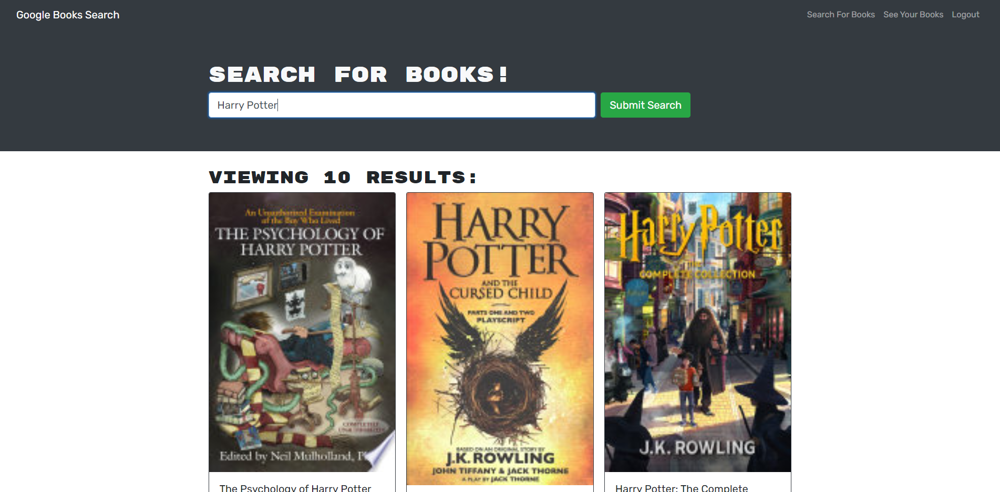

  # Book Search Engine

  
  ## Description

  This project serves as a google api based book search engine!  This project uses a MERN stack to function, using GraphQL, mongoDB, React, ApolloServer, Express, NodeJS, and Javascript for the main functionality!  It is used to search for books within the google database, and then view and save the said books into the database.  It uses user authentication as well.
  
---
  ## Table of Contents

  * [Installation](#installation)
  * [Usage](#usage)
  * [License](#license)
  * [Contribution](#contribution)
  * [Tests](#tests)
  * [Questions](#questions)
---
  ## [Installation](#table-of-contents)

  To install the project, please have the files downloaded to your localhost, and have node.js installed.  First, use ```npm install``` in your root directory, and then once everything has been installed, you may use ```npm start``` to start the application.  

---
  ## [Usage](#table-of-contents)

  To use this application, you may visit [Book Search Engine](https://enigmatic-depths-90085.herokuapp.com/) for the webpage, or you may use the installation instructions to install it on your local machine.  You will also need a mongoDB for this, so please make sure you have that available as well.  
  

---
  ## [License](#table-of-contents)

  The application is covered under the following license:

  [MIT](https://choosealicense.com/licenses/MIT)

---
  ## [Contribution](#table-of-contents)

  To contribute, please contact me below!

---
  ## [Tests](#table-of-contents)

  To test the application, follow the installation steps, and then you may change any code you find necessary to make the application function differently!

---
  ## [Questions](#table-of-contents)

  Please use the following links for contact:

  [GitHub](https://github.com/areed98)

  [Email: austinjreed89@gmail.com](mailto:austinjreed89@gmail.com)
